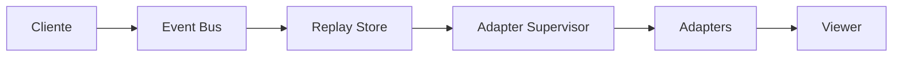
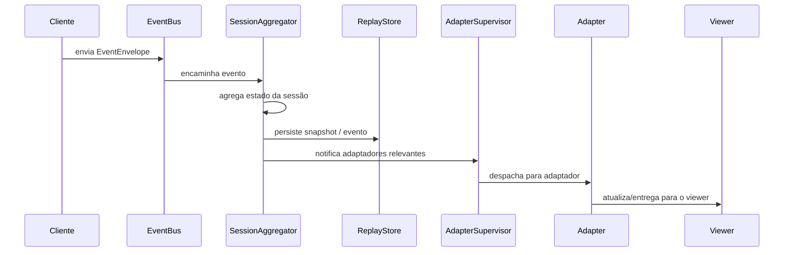
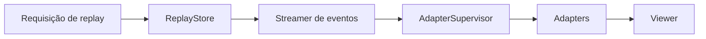
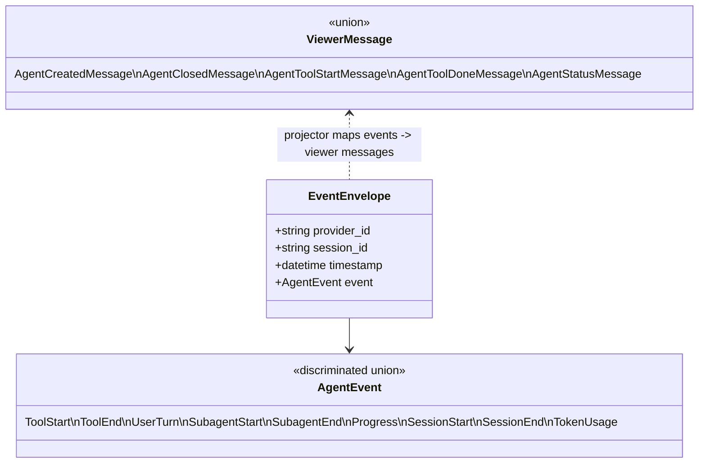

# Arquitetura

Visão geral simplificada dos componentes principais e fluxos de eventos.

Descreva aqui os componentes em detalhe (event bus, agregadores de sessão, replay store, adaptadores).

## Ciclo de vida do evento (detalhado)

```mermaid
flowchart LR
  Client["Cliente / Fonte"] --> Ingest["Ingest / Validação"]
  Ingest --> EventBus["Event Bus / Broker"]
  EventBus --> Enricher["Enriquecedor / Normalizador"]
  Enricher --> ReplayStore["Replay Store / Persistência"]
  ReplayStore --> SessionAggregator["Session Aggregator"]
  SessionAggregator --> AdapterSupervisor["Adapter Supervisor"]
  AdapterSupervisor --> Adapters["Adaptadores (OTel, debug, file, ...)"]
  Adapters --> Viewer["Viewer / UI"]
```

## Agregação de sessão (sequência)

## Fluxo de replay

## Mensagens / Contratos (visão simplificada)

> Nota: os nomes de eventos e mensagens são derivados de `app/protocol/domain_events.py` e `app/protocol/viewer_messages.py`.

Esses diagramas usam o plugin `mkdocs-mermaid2-plugin`; ao visualizar localmente com `mkdocs serve` o mermaid será renderizado automaticamente.
